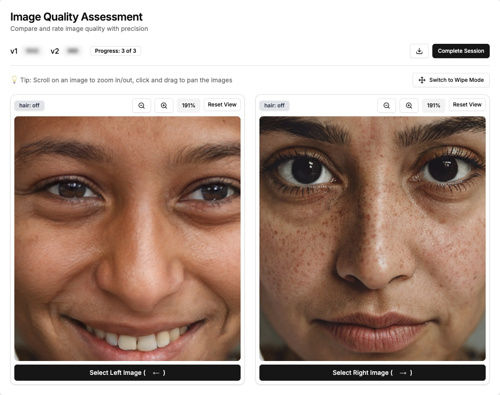
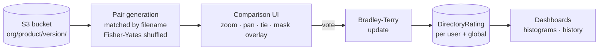

# OptiQA — Image Quality Assessment Tool (by PiktID)

**Rank image batches by quality using head-to-head votes instead of absolute scores.**

Scoring image quality on a 1–10 scale is unreliable — raters disagree, drift over time, and
anchor differently. OptiQA sidesteps the problem the way [LMArena](https://lmarena.ai) ranks
language models: show people **pairs** of images, ask only *which is better*, and let a
**Bradley-Terry / Elo-style** model turn thousands of cheap binary judgements into a single
ranking per batch.



<sub>The evaluation screen: two versions of the same source image, synced zoom/pan for pixel-level
inspection, and keyboard-driven voting.</sub>

[](https://nextjs.org)
[](https://react.dev)
[](https://www.typescriptlang.org)
[](https://www.prisma.io)
[](https://www.postgresql.org)
[](./LICENSE)

> Built as an internal PiktID tool starting **January 2025** to answer a recurring question —
> *"is this new model checkpoint actually better than the last one?"* — and open-sourced in
> **2026** after a security review and refactor (credential removal, server-side S3 access,
> a shared library layer, tests, and a strict build).

---

## The problem it solves

You retrain an image model and produce a new batch of outputs. Is version 2 better than
version 1? Eyeballing a few samples is anecdotal, and asking raters for absolute scores gives
you noise. What you actually want is a **statistically meaningful, aggregated preference**
across a whole batch and across multiple raters.

OptiQA gives you exactly one number per version, built from votes that are trivially easy to
cast.

## How it works

Every version (directory of images) starts at a strength of **1000**. Each vote updates both
sides, scaled by how *surprising* the result was — an upset moves the scores more than an
expected win.

```
expected(A beats B) = strength(A) / (strength(A) + strength(B))

on a win:   change   = K × (1 − expected(winner))
            winner  += change
            loser   -= change          # floored at 1

on a tie:   uses K/2, nudging both sides toward their expected probability
```

with `K = 32`. The math lives in [`src/lib/rating.ts`](./src/lib/rating.ts) as pure,
side-effect-free functions — which is what makes it unit-testable in isolation
([`rating.test.ts`](./src/lib/rating.test.ts), 13 cases). The React layer
(`useBradleyTerry.ts`) is a thin stateful wrapper over it.

Ratings are tracked **per user** and aggregated **globally per organization**, so you can see
both individual preference and batch-level consensus.

### Flow



Batch A and Batch B are paired by **base filename**, so `cat_01.png` in v1 is always compared
against `cat_01.png` in v2 — you're measuring the version difference, not image-to-image
variance. Pair order is shuffled, and left/right placement is randomized per pair to cancel
out position bias.

## Key features

- **Pairwise comparison UI** with zoom/pan for close inspection, tie support, and optional
  mask/reference-image overlays.
- **Bradley-Terry / Elo scoring** per directory (version), aggregated per user and globally
  across an organization.
- **Organization-scoped access** — only approved members of an org can evaluate and see that
  org's ratings. Joining is gated by invite codes (see [`INVITE_CODE_SYSTEM.md`](./INVITE_CODE_SYSTEM.md)).
- **Comparison sets** — admins can predefine v1-vs-v2 directory pairs for members to evaluate,
  with a per-member "comparisons to grade" inbox.
- **S3-backed image storage** browsed by `organization/product/version` folder structure,
  with presigned URLs so credentials never reach the browser.
- **Ratings dashboards & histograms** to inspect score distributions and history.

## Tech stack

Next.js 15 (App Router) · React 19 · TypeScript · Tailwind + shadcn/ui · Prisma 6 +
PostgreSQL · NextAuth v5 (Google OAuth) · AWS S3 · Vercel KV · chart.js. Deployed on Vercel.

For an architectural deep-dive (domain model, rating algorithm, comparison flow, API routes,
auth), see **[CLAUDE.md](./CLAUDE.md)**.

---

## Quick start (one command, Dockerized DB)

**Prerequisites:** Node.js 18+, plus an AWS S3 bucket and Google OAuth credentials if you want
image loading and sign-in to work.

If you have [mise](https://mise.jdx.dev) and Docker Desktop, you don't need to install or
manage Postgres yourself — a containerized DB is started, migrated, and torn down for you:

```bash
cp .env.example .env.local   # then add your AWS / Google / NextAuth values
npm install
mise install                 # installs the pinned Node version
mise run dev                 # starts the DB container, applies the schema, runs the app
mise run stop                # stops the DB container when you're done
```

`mise run dev` → http://localhost:3000. The default `DATABASE_URL` in `.env.example` already
matches the bundled `docker-compose.yml` database. Other handy tasks: `mise run db-reset`
(wipe + recreate the DB), `mise run check` (lint + typecheck + test + build).

Prefer plain npm (still Dockerized DB, no mise)?

```bash
npm run dev:local   # docker compose up --wait db && prisma generate && db push && next dev
npm run db:down     # stop the DB container
```

> Requires Docker Desktop to be running. If you'd rather use a local/hosted Postgres instead
> of Docker, skip these and follow the manual setup below.

## Setup (manual / bring-your-own Postgres)

**Prerequisites:**

- Node.js 18+ (repo predates current LTS; modern Node works)
- PostgreSQL (local via Homebrew `postgresql@15`, or a hosted DB)
- An AWS account with an S3 bucket
- Google OAuth credentials (for sign-in)

1. Install dependencies:
   ```bash
   npm install   # runs `prisma generate` via postinstall
   ```

2. Configure environment:
   ```bash
   cp .env.example .env.local
   ```
   Then fill in `.env.local`. Required variables:
   - `DATABASE_URL` — Postgres connection string
   - `AWS_REGION`, `AWS_ACCESS_KEY_ID`, `AWS_SECRET_ACCESS_KEY`, `S3_BUCKET_NAME` — S3
     (server-side only; **never** `NEXT_PUBLIC_`-prefixed, so the keys stay out of the
     client bundle)
   - `NEXTAUTH_SECRET`, `NEXTAUTH_URL` — NextAuth
   - `GOOGLE_CLIENT_ID`, `GOOGLE_CLIENT_SECRET` — Google OAuth
   - Optional: `KV_*` (Vercel KV), `LOG_LEVEL`, `NEXT_PUBLIC_MIN_COMPARISONS`,
     `NEXT_PUBLIC_DISABLE_AUTH=true` (bypass auth in dev only)

3. Set up the database:
   ```bash
   # ensure Postgres is running
   pg_isready -h localhost -p 5432    # brew services start postgresql@15

   npx prisma generate
   npx prisma db push    # or: npx prisma migrate dev
   ```

4. Run the dev server:
   ```bash
   npm run dev           # http://localhost:3000
   npm run dev --host    # expose on the local network
   ```

## Scripts

```bash
npm run dev        # development server (assumes a DB is already running)
npm run dev:local  # start Dockerized DB + migrate + dev server (one command)
npm run db:up      # start the Docker DB; db:down to stop; db:reset to wipe + recreate
npm run build      # prisma generate && next build (strict: type + lint errors fail it)
npm run start      # production server
npm run lint       # next lint
npm run typecheck  # tsc --noEmit
npm test           # vitest unit tests (rating math, path normalization, invite codes, upload)
```

(With mise: `mise run dev`, `mise run stop`, `mise run db-reset`, `mise run check`.)

The production build enforces types and lint errors (`next.config.js` sets
`ignoreBuildErrors`/`ignoreDuringBuilds` to `false`). Stylistic/legacy lint rules are
warnings so they don't block the build; genuine correctness rules fail it.

Useful admin/data scripts live in `scripts/` and `prisma/` (e.g. `setup-admin.ts`,
`copy-prod-to-local.sh`, `reset-prod-ratings.ts`). Read them before running — several touch
production data.

## Security notes

- **AWS credentials are server-side only** (`AWS_*` / `S3_BUCKET_NAME`, no `NEXT_PUBLIC_`
  prefix). All S3 access goes through `src/lib/s3.ts` and server API routes, so keys are
  never bundled into client code.
- **Never commit real credentials.** All `.env*` files except `.env.example` are gitignored.
  Database dumps (`*.dump`, `*.sql` backups) are gitignored too — they can contain tokens/PII.
- **Invite codes are generated with a CSPRNG** (`crypto.randomInt`, see
  [`src/lib/invite-code.ts`](./src/lib/invite-code.ts)) — redeeming one grants org membership,
  so codes are treated as secrets.
- Use an IAM user scoped to the single S3 bucket with least-privilege permissions; rotate
  keys regularly; enable bucket encryption and CORS for your domain.
- See [SECURITY.md](./SECURITY.md) for how to report vulnerabilities.

## Contributing

See [CONTRIBUTING.md](./CONTRIBUTING.md). In short: `npm run lint && npm run typecheck &&
npm test && npm run build` must pass, and shared logic belongs in `src/lib/` with unit tests.

## License

MIT — see [LICENSE](./LICENSE).
